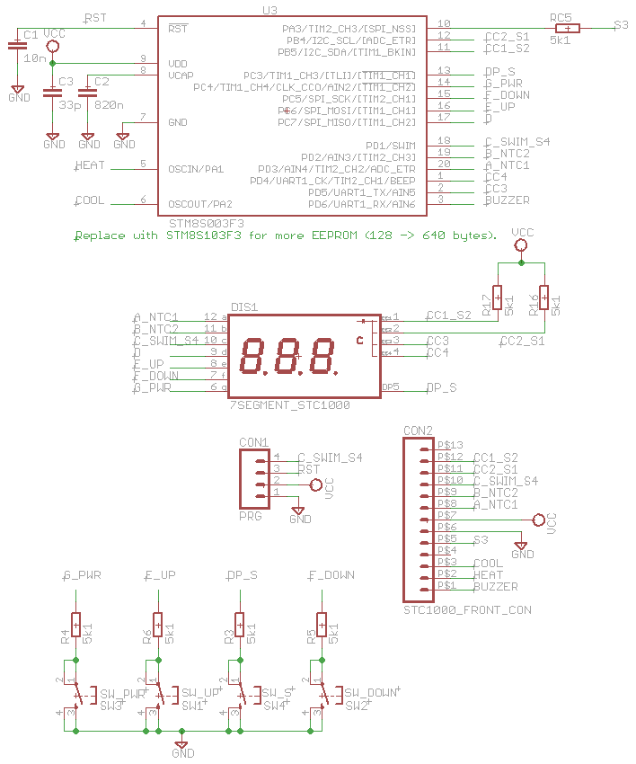

STC\-1000+\-STM8
==========

This version of the STC\-1000+ is heavily based on the beautiful work from Mats Staffansson (https://github.com/matsstaff/stc1000p), where he creates an open-source implementation of firmware(s) for the STC\-1000 dual stage thermostat.
Mats version is used by numerous home-brewers for automating their brewery / climate chamber. The hardware is controlled by a **PIC18F1828** microcontroller (uC), which is pretty limited. Despite these limitations Mats succeeded in
adding 6 profiles with up to 9 temperature-time pairs per profile.

I bought a couple of STC\-1000 devices which had another uC with completely different hardware on-board. It is the **STM8S003F3** uC. Being the electrical engineer that I am, I wanted to reverse engineer
the hardware, create the schematics and new boards and (like Mats) add new features. You can find the schematics (with the Eagle design files) all here. I also used Mats software as a start, but needed to heavily modify it in order
to run on the new hardware platform.

So, for those of you who have this version of the STC\-1000: enjoy! Because now you can have almost the same functionality as Mats realised in the PIC version of the STC\-1000. There's only one real drawback: the STM8 uC
only has 128 bytes of EEPROM, so the number of profiles and the number of temperature-time pairs per profile are reduced. But you get more features as a standard (switchable) option (instead of programming a different firmware version). 
For those of you willing to do some de-soldering (see text below): you can replace the uC with a **STM8S103F3** uC that has 640 bytes of EEPROM. Then you have the 6 profiles with all temperature-time pairs again.

 
*The frontpanel and backplane of the STC\-1000 device*

 
*the top of the STC1000\-device. Note the label '0602 05 R QC'*

Questions?
----------
Please don't open github issues for general questions. Only open an issue if you discovered an actual bug or have a (realistic) feature request (or better yet, send a pull request).

Quick start
-----------

You'd need one of those fancy coloured ST-Link V2 USB adapter (which are very cheap to find on ebay) and of-course a STC\-1000 with a STM8. Mine has a label '0602 05 R QC' on top, the PCB itself has a mark 'WR-032'. Furthermore you need
the IAR development environment for STM8, which can be downloaded free of charge. Use the code-size limited version. After having installed this, the drivers for the ST-Link USB adapter are also installed.

The frontpanel PCB already has a 4-pin connector (labeled with SIG, RST, VCC and GND). Solder some pins to this and connect the ST-Link adapter (use GND-GND, RST-RST and SWIM-SIG. VCC is not needed). This is all you need to reprogram the device! 
Power-up the STC\-1000 and connect the ST-Link V2 USB. 
If you have downloaded the project- and source-files, open the project in IAR, do a Project->Rebuild All and then press Ctrl-D. This opens the debugger and transfers the code to the microcontroller. The first time you do this, a message pops up stating that
protection bits are set and these need to be cleared. If you do this (necessary if you want to reprogram the uC), the program present is erased (with no way of getting this back!).

Remove the wires, re-cycle power and you are good to go!

Introduction (taken from https://github.com/matsstaff/stc1000p)
----------------------------------------------------------

The STC\-1000 is a dual stage (that is, it can control heating *and* cooling) thermostat that is pretty affordable. It is microcontroller operated, that means there is a sort of 'computer on a chip' that reads the temperature of the probe, turns the relays on and off, reads the state of the buttons and updates the display. 
To do all this, the microcontroller needs to be programmed to perform these tasks. The program is stored in non volatile (flash) memory that is retained when there is no power. The microcontroller can be reprogrammed (flashed) with a new program (firmware), that can other or additional tasks. 
To do that, a new firmware is needed and you need a programmer that can send it to the microcontroller the way it expects it. The STC\-1000\-STM8 project provides both these things (and a few additional things as well).

So far so good, *but* there is a catch. Probably due to the popularity of the STC\-1000, there are a number of clones out there. These are functionally (from a user perspective) equivalent, but are not based on the same design. 
Specifically, they use other microcontrollers that while having similar specifications, use completely different architectures. 

This STC\-1000+ version is *only* compatible with the **WR-032** version of the STC\-1000 as this supports the **STM8S003F3** microcontroller, for which you have a code-size limited (8K) version of IAR available. IAR is the embedded development tool which you use to program the device in the C-language.
To upload (flash) the microcontroller, you also need the ST-Link V2 USB adapter ($2-$3 on ebay). There are official ST-Link programmers to purchase, but they typically cost a lot more. Neither of these options are very cost effective, considering the price of the STC\-1000. 

Schematics
----------
I reversed engineered both the frontpanel PCB as well as the backplane PCB. The frontpanel PCB holds the buttons, the 7-segment display (3 digit common-cathode) as well as the **STM8S003F3** uC. There's an ingenious soldered connection to the
backplane that holds both relays (able to switch 12A at 230VAC), the power-supply (12V and 5V) and the connectors. The schematics were made with the Eagle PCB program.

 
*Eagle schematic of the Frontpanel*

Two interesting feature are shown in this schematic:
- The **S1** and **S2** lines. It looks likes this is an I2C interface. Interesting feature for those of you willing to do some more hacking! With the current hardware, it is only used for multiplexing the 7-segment display. It is not used in this firmware version, these lines are solely for multiplexing the 7-segment displays.
- The **S3** line. Now this is interesting, it is the only hardware pin *NOT* used. The new firmware uses it to switch an SSR (with a slow PWM signal) controlled by a PID-controller. But I guess it can be used for other purposes as well.

 
*Eagle schematic of the Backplane*

Replacing the STM8S003F3 uC for more EEPOM size
-----------------------------------------------
You do not need to do this, but if you replace the existing **STM8S003F3** microcontroller (uC) with a **STM8S103F3** uC, you get 640 bytes of EEPROM and you can have 6 profiles with up to 9 temperature-time pairs (same as in Mats his version).
You can skip this section if you are not into soldering small devices and the default profiles are oke for you. To replace the device, you would need the following:
- A new **STM8S103F3P6** device (Mouser part nr. 511-STM8S103F3P6). This is a 20-pin TSSOP package that costs about a $1.
- A hot-air rework station for SMD devices (I bought a 858D hot-air station that is very affordable on ebay)
- A soldering iron.
- Solder wick.
- Solder paste. This typically comes with an injection-needle for applying just a little paste on every solder pad.

To start with, we want to remove the frontpanel PCB from the backplane. Remove all the solder-joints with the solder wick. Place the solder wick over the solder-joints, heat it up with the soldering iron and make sure that the solder wick absorbs all solder.
After having done this, it is possible to remove the frontpanel from the backplane with just a little bit of pulling. Be careful, since you don't want to break anything.
 
*This is how it looks after the frontpanel is removed from the backplane*

Next: use the hot-air to heat-up one side of the uC. Use a sharp knife and place it under the uC. Carefully lift-up one side. If this is done, let it cool down and heat-up the other side.
When the solder melts, it is easy to remove the uC. Use the solder-wick again to remove excess solder from the solder-pads.

If you don't have access to a hot-air rework station, here's a tip from Mats himself: one can can simply thread a thin wire under the legs on one side of the IC, fix one end of the wire and heat the legs with a soldering iron (starting at the other end) while keeping the wire under tension. As the solder melts, you pull the wire under the leg/pad, freeing them.

Then: apply solder paste to the solder-pads of the uC and position the **STM8S103F3P6** exactly above the pads. Note the orientation of the device (there's a small circle denoting pin 1), you don't want to solder it upside-down! It would be wise at this point to connect the ST-Link V2 USB device to the programming connector and see if
you can connect to the device. If all is well, solder both PCB boards back together.

Updates
-------

|Date|Release|Description|
|----|-------|-----------|
|2016-10-27|v1.00|First release, copied from https://github.com/matsstaff/stc1000p

