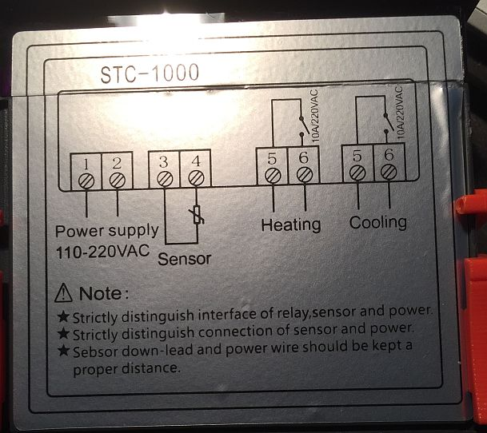
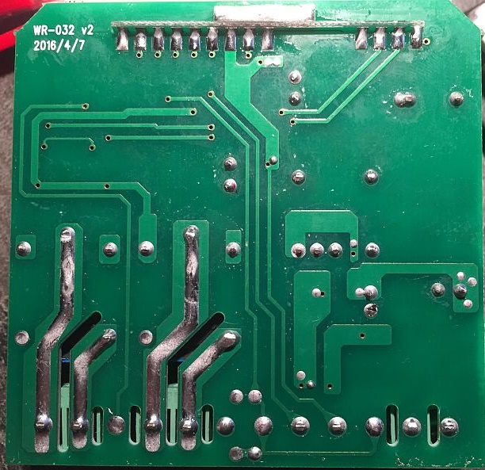
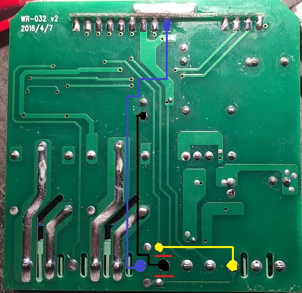

# New hardware revision WR-032 v2
==========

Recently (november 2016) I bought a couple of new STC-1000 devices and was amazed that, instead of the familiar WR-032 label, a new hardware revision was shipped. It was labeled **WR-032 v2** with date **2016/4/7**.

 
*The top of the new STC-1000 device. Note that there's no label anymore!*

The frontpanel does state **WR-032 v2** but it seems that this is still the same as the original version. The microcontroller is still the **STM8S003F3** device, so no changes here. Only the backplane shows some changes.

 
*The backplane of the STC-1000 device with the new hardware revision*

## What has changed from the first WR-032 revision?
----------
To start with, the new hardware revision is definitely NOT an improvement. No new features are added. The following things have changed:
- The DC-DC converter chip (LNK567) has been replaced by another IC. This is not something to worry about: there's still 12VDC and 5VDC being made
- The **S3 output** line is no longer wired to the terminal-blocks.
- The 2nd temperature probe is now also wired to the terminal-block pin (pin 4) that we used as GND. This needs to be fixed if we still want PID-controlled SSR output.
- Capacitor C9 is now populated (temperature conversion for 2nd temperature probe). This has no impact on the STC-1000p-STM8 firmware, since the ADC-input routine already deals with this.
- Resistors R25 (S4 output), R26 (S1 output) and R27 (S2 output) are no longer populated. This is also not a problem.

## What do we need to change?
-----------
- The GND connection at the 5-pin terminal-block needs to be connected to GND again. It is now connected to the second temperature probe.
- The **S3 output** needs to be connected to the SSR connection at the 5-pin terminal-block. This pin is now NOT connected.

## What if I don't want to change anything?
----------------------------------------------------------
- You loose the slow-PWM PID-controlled SSR output.
- A 5-pin terminal-block is no longer useful, since pin 4 is now connected to pin 1 (2nd temperature probe) and pin 5 is not connected. Solder a 3-pin terminal block in place, so you can still connect a 2nd temperature probe.

All other functionality will remain intact. So you can still have 2 temperature probes. Up to you to decide if you need to make the hardware changes.

## Ok, what do I need to change?
----------
To get the same functionality as with the original WR-032 hardware (in combination with the STC-1000p-STM8 firmware of-course), you need to prepare the connectors the same way you did with the original version:
- Remove the 2-pin terminal-block for the temperature sensor.
- Replace it with a 5-pin terminal-block with a pitch of 5 mm.

Then, proceed with the following:
- Cut the 2 wires going to and from pin-4 of the 5-pin terminal block. Cut where the **red** lines are in the picture. This pin is now completely isolated from anything else. Measure with a multimeter!
- Solder a wire between pin 1 of the 5-pin terminal block to the S1 solder-pad. This is the **yellow** line in the picture. Now the 2nd temperature probe is connected again with the original line.
- Solder the now isolated pin-4 of the 5-pin terminal block to the GND connection of the 470 µF/25V capacitor. This is the **black** line in the picture.
- Solder pin 5 of the 5-pin terminal-block to pin 5 of the frontpanel connector. This is the **S3-output** line and the **blue** line in the picture.

 
*The backplane of the STC-1000 device with the proposed changes*

Now you have the same functionality again as with the standard WR-032 hardware revision.

