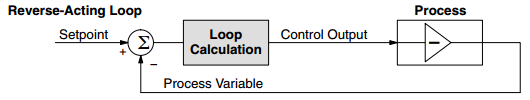
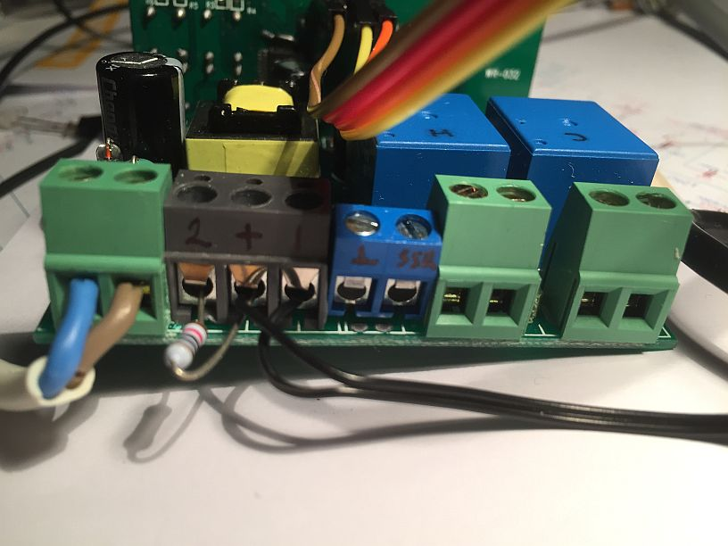

STC-1000p-STM8 USER MANUAL 
=====================

Mats Staffansson / Emile

© 2014-2020

# Changelog

2016-11-04:	First version of STC-1000p for STM8 
2016-12-05: Direct- (heating-loop) or reverse-acting (cooling-loop) PID now selectable with **Hc** parameter 
2020-02-29: Option added (**Pb** = 2) to control a refrigerator and the compressor fan

# Features

* Fahrenheit or Celsius display selectable with **CF** parameter
* Minutes or hours time-base selectable with **Hrs** parameter
* PID-controller selectable with adjustable **Kc**, **Ti**, **Td** and **Ts** parameters
* PID-output polarity selectable with **Kc** parameter. Forward-acting (heating-loop) or reverse-acting (cooling-loop)
* PID-output signal (slow PWM, T=12.5 sec) present at **S3 output** for connection to a Solid-State Relay (SSR)
* Standard thermostat functionality available when PID-controller is disabled (**TS** parameter set to 0)
* Second temperature probe functionality selectable with **Pb2** parameter. If **Pb2** is set to 0, no second temperature probe is connected.
+ With **Pb2** set to 1, the second temperature probe should measure the outside temperature. Used in thermostat control.
+ With **Pb** set to 2, the second temperature probe should measure the compressor temperature of a refrigerator. Used in refrigerator mode to also control the compressor fan.
* Up to 4 profiles with up to 6 setpoints (6 profiles with 10 setpoints if the STM8S003F3 is replaced with a STM8S103FS µC)
* Each setpoint can be held for 1-999 hours (i.e. up to ~41 days) or 1-999 minutes (i.e. up to ~16 hours)
* Approximative ramping
* Somewhat intuitive menus for configuring
* Separate delay settings for cooling and heating
* Configurable hysteresis (allowable temp swing) from 0.0 to 2.5°C or 0.0 to 5.0°F
* User definable alarm when temperature is out of or within range
* Easy displaying of setpoint, thermostat/PID-mode, actual temperature (default), 2nd temperature and PID-output (%)

# Using the STC-1000p-STM8 firmware

## Navigation and menus

By default the current temperature is displayed in °C or °F on the display, depending on the **CF** parameter. Pressing the 'S' button enters the menu. Pressing button 'Up' and 'Down' scrolls through the menu items. 
Button 'S' selects and 'Power' button steps back or cancels current selection.

The menu is divided in two steps. When first pressing 'S', the following choices are presented:

|Menu item|Description|
|--------|-------|
|Pr0|Set parameters for profile 0|
|Pr1|Set parameters for profile 1|
|Pr2|Set parameters for profile 2|
|Pr3|Set parameters for profile 3|
|Pr4|Set parameters for profile 4 (STM8S103F3 only)|
|Pr5|Set parameters for profile 5 (STM8S103F3 only)|
|Set|Settings menu|
*Table 2: Menu items*

Selecting one of the profiles enters the submenu for that profile.

Pr0-3 submenus have the following items:

|Sub menu item|Description|Values|
|--------|-------|-------|
|SP0|Set setpoint 0|-40.0 to 140͒°C or -40.0 to 250°F|
|dh0|Set duration 0|0 to 999 hours|
|...|Set setpoint/duration x|...|
|dh4 (dh8 with STM8S103F3)|Set duration 4 (8)|0 to 999 hours|
|SP5 (SP9 with STM8S103FS)|Set setpoint 5 (9)|-40.0 to 140°C or -40.0 to 250°F|
*Table 3: Profile sub-menu items*

You can change all the setpoints and durations associated with that profile from here. When running the programmed profile, *SP0* will be the initial setpoint, it will be held for *dh0* hours (unless ramping is used). 
After that *SP1* will be used as setpoint for dh1 hours. The profile will stop running when a duration (*dh*) of 0 hours OR last step is reached (consider *dh5* implicitly 0). When the profile has ended, STC-1000p-STM8 will automatically switch to thermostat mode with the last reached setpoint. (So I guess you could also consider a *dh* value of 0 as infinite hours).

The settings menu has the following items:

|Sub menu item|Description|Values|
|---|---|---|
|SP|Set setpoint|-40 to 140°C or -40 to 250°F|
|hy|Set hysteresis|0.0 to 5.0°C or 0.0 to 10.0°F|
|hy2|Set hysteresis for 2nd temp probe|0.0 to 25.0°C or 0.0 to 50.0°F|
|tc|Set temperature correction|-5.0 to 5.0°C or -10.0 to 10.0°F|
|tc2|Set temperature correction for 2nd temp probe|-5.0 to 5.0°C or -10.0 to 10.0°F|
|SA|Setpoint alarm|0 = off, -40 to 40°C or -80 to 80°F|
|St|Set current profile step|0 to 4 (8)|
|dh|Set current profile duration|0 to 999 hours|
|cd|Set cooling delay|0 to 60 minutes|
|hd|Set heating delay|0 to 60 minutes|
|rP|Ramping|0 = off, 1 = on|
|cF|Celsius or Fahrenheit display|0 = Celsius, 1 = Fahrenheit|
|Pb2|Enable second temp probe for use in thermostat control|0 = off, 1 = on, 2 = refrigerator mode with compressor fan control|
|HrS|Select Hours or Minutes time-base|0 = minutes, 1 = hours|
|Hc|Kc parameter for PID-controller in %/°C|-9999 to 9999|
|Ti|Ti parameter for PID-controller in seconds|0 to 9999|
|Td|Td parameter for PID-controller in seconds|0 to 9999|
|Ts|Ts parameter for PID-controller in seconds|0 to 9999|
|rn|Set run mode|Pr0 to Pr5 and th|
*Table 4: Settings sub-menu items*

**Setpoint**, well... The desired temperature to keep. The way STC-1000p-STM8 firmware works, setpoint is *always* the value the thermostat or the PID-controller strives towards, even when running a profile. What the profile does is simply setting the setpoint at given times.

**Hysteresis**: This parameter is used when the thermostat controls the temperature (**Ts** is set to 0). This parameter then controls the allowable temperature range around the setpoint where the thermostat will not change state. For example, if temperature is greater than setpoint + hysteresis AND the time passed since last cooling cycle is greater than cooling delay, then cooling relay will be engaged. Once the temperature reaches setpoint again, cooling relay will be disengaged.

**Hysteresis 2**, This parameter is used when the thermostat controls the temperature (**Ts** is set to 0). Futhermore if **Pb2** is set to 1, temperature probe 2 should measure the environmental temperature. Now the allowable temperature range around the setpoint for temperature probe 2 is controlled. For example, if temperature 2 is less than **SP - hy2**, the cooling relay will cut out even if **SP - hy** has not been reached for temperature. Also, cooling will not be allowed again, until temperature 2 exceeds **SP - 0.5 \* hy2** (that is, it has regained at least half the hysteresis). 
If **Pb2** is set to 2, then this parameter controls the compressor fan (which should be connected to the heater output). For example: if **Hysteresis 2** is set to 100 E-1 °C, the compressor fan is switched on when probe 2 temperature exceeds 35 °C (30 + **Hysteresis 2**/2) and switched off when probe 2 temperature is below 25 °C (30 - **Hysteresis 2**/2). Temperature probe 2 should in this case be attached to one of the compressor output pipes (which should get hot when the compressor is turned on).

**Temperature correction**, will be added to the temperature sensor, this allows the user to calibrate the temperature reading. It is best to calibrate with a precision resistor of 10 k Ohms (1% tolerance). Replace the temperature sensor with such a resistor, let the STC-1000p-STM8 run for at-least half an hour and adjust this parameter such that the temperature display is set to 25.0 °C.

**Temperature correction 2**, same as *temperature correction*, but for the second temperature probe. If you remove the existing 2-pin terminal-block and replace it with a 5-pin terminal-block (see below for details), you can connect a second temperature sensor. The 1st temperature sensor is connected to pins 2 and 3 (seen from the left), the 2nd temperature sensor can now be connected between 1 and 2. Enable this 2nd sensor with the **Pb2** parameter.

**Setpoint alarm**, if setpoint alarm is greater than 0.0, then the alarm will sound once temperature differs from *SP* by more than *SA* degrees (this can be useful to warn against malfunctions, such as fridge door not closed or probe not attached to carboy). If *SA* is less than 0.0, then the alarm will sound if the temperature does **NOT** differ by more than (-) *SA* degrees (this could be used as an indication that wort has finally reached pitching temp). If *SA* is set to 0.0, the alarm will be disabled. If the alarm is tripped, then the buzzer will sound and the display will flash between temperature display and showing "SA", it will not however disengage the outputs and the unit will continue to work as normal. Please note, that care needs to be taken when running a profile (especially when not using ramping or with steep ramps) to allow for a sufficiently large margin, or the alarm could be tripped when setpoint changes.

**Current profile step** and **current profile duration**, allows 'jumping' in the profile. Step and duration are updated automatically when running the profile, but can also be set manually at any time. Note that profile step and profile duration are the variables directly used to keep track of progress in a profile. Little or no validation is made of what values are entered. It is up to the user to know what he/she is doing by changing these values. Changing these values will not take effect until next point in profile is calculated, which could be as much as one hour. Every hour, current duration, *dh* (and if next step is reached, also current step, *St*) is updated with new value(s). That means in case of a power outage, STC-1000p-STM8 will pick up (to within the hour) from where it left off. Current profile step and current profile duration are only available in the menu when a profile is currently running.

**Cooling** and **heating delay** is the minimum 'off time' for each relay, to spare the compressor and relays from short cycling. If the the temperature is too high or too low, but the delay has not yet been met, the corresponding LED (heating/cooling) will blink, indicating that the controller is waiting to for the delay to pass before it will start heating or cooling. When the controller is powered on, the initial delay (for both heating and cooling) will **always** be approximately 1 minute, regardless of the settings. That is because even if your system could tolerate no heating or cooling delays during normal control (i.e. *cd* and/or *hd* set to zero), it would be undesirable for the relay to rapidly turn on and off in the event of a power outage causing mains power to fluctuate. Both cooling and heating delays are loaded when either cooling/heating relays switched off. So, for instance if you set cooling delay to 60 minutes and setpoint is reached, turning cooling relay off, it will be approximately one hour until cooling relay will be allowed to switch on again, even if you change your mind and change the setting in EEPROM (i.e. it will not affect the current cycle).

The delay can be used to prevent oscillation (hunting). For example, setting an appropriately long heating delay can prevent the heater coming on if the cooling cycle causes an undershoot that would otherwise cause heater to run. What is 'appropriate' depends on your setup.

**Ramping** can be used to gradually increase the setpoint when going from one setpoint to another. See below for a more detailed explanation.

**Celsius or Fahrenheit** can be used to set display mode for temperatures to Celsius or Fahrenheit. Note that the values stored in EEPROM are not directly changed with it, so if you change this, you need to make sure that the stored parameters are updated!

**Second temperature probe** can be used to enable the second temperature probe. See below for a more detailed explanation.

**Hours or Minutes** can be used to select between a time-mode in hours or minutes. Typically the minutes time-mode is selected when you want to control a brewing-session. When controlling a fermentation in a climate controlled chamber, you typically select hours.

**Hc**, this is the proportional gain for the PID controller. It also selects the PID-mode: **forward-acting** (**Hc** > 0) or **reverse-acting** (**Hc** < 0). See below for a more detailed explanation.

**Ti**, this is the integral time-constant in seconds for the PID controller. See below for a more detailed explanation.

**Td**, this is the differential time-constant in seconds for the PID controller. See below for a more detailed explanation.

**Ts**, this is the sample-time in seconds for the PID controller. The PID-controller runs every **Ts** seconds. When set to 0, the PID-controller is disabled and normal thermostat (on-off) control is enabled. If you set this time too small, the pid-controller becomes too sensitive for changes in temperature. A decent value for temperature control is around 20-30 seconds (yes, that slow! It's temperature remember, doesn't change that quick). See below for a more detailed explanation.

**Run mode**, selecting *Pr0* to *Pr3* (*Pr5* with an STM8S103F3) will start the corresponding profile running from step 0, duration 0. Selecting *th* (when **Ts** = 0) or *PId* (when **Ts** > 0) will switch to thermostat/PID mode, the last setpoint from the previously running profile will be retained as the current setpoint when switching from a profile to thermostat/PID mode.

## Thermostat mode (**Ts** = 0)

When mode is set to thermostat (the **Ts** parameter needs to be set to 0), setpoint, *SP*, will not change and the controller will aim to keep the temperature to within the range of *SP* ± *hy*. Much like how the normal STC-1000 firmware works. The thermostat control runs once every second. The PID-controller output with the **S3 output** (for connection to a SSR) is disabled in this case.

## PID-Control mode (**Ts** > 0)

When the **Ts** parameter is set to a value > 0, the PID-controller is enabled and thermostat-control is disabled. Both the heating and the cooling relays are switched off in this mode. The PID-controller uses a sophisticated algorithm (a Takahashi Type C velocity algorithm) where the new output value is based upon the previous output value. The derivation of the algorithm for this controller is given in the .pdf document [PID Controller Calculus](./PID_Controller_Calculus.pdf).
The PID-controller is controlled with the *proportional gain*, *integral time-constant*, *differential time-constant* and the *Sample-Time*. They all work closely together. For more information on how to select optimum settings for a PID-controller, please refer to http://www.vandelogt.nl/uk_regelen_pid.php

The pid-output is a percentage between 0.0 and +100.0 %. It is in E-1 %, so a value of 123 actually means 12.3 %. This value can be seen by pressing the PWR button twice (one press shows the 2nd temperature, the 2nd press shows the pid-output percentage). This is where the polarity of the **Hc** parameter comes into play. Set **Hc** to a positive value for a so-called **direct-acting** process loop. This means that when the PID-output increases, the temperature (which is the process variable, or PV) also eventually increases. Of course, a true process is usually a complex transfer function that includes time delays. Here, we are only interested in the direction of change of the process variable in response to a PID-output change. Most process loops will be **direct-acting**, such as a temperature loop. An increase in the heat applied increases the temperature. Accordingly, direct-acting loops are sometimes called heating loops.

 
*A Direct-Acting process control loop*

If the **Hc** parameter is set to a negative value, a so-called **reverse-acting** process loop is selected. A **reverse-acting** loop is one in which the process has a negative gain, as shown below. An increase in the control output results in a decrease in temperature. This is commonly found in refrigeration controls, where an increase in the cooling input causes a decrease in the process variable (the temperature). Accordingly, reverse-acting loops are sometimes called cooling loops.

 
*A Reverse-Acting process control loop*

**Source:** the above text and both images are copied from (and slightly adapted) from the DL05 Micro PLC User Manual, which has an excellent chapter (chapter 8) on PID-control.

The pid-output percentage is available at the **S3 output** as a slow PWM signal (period-time is 12.5 seconds), with the duty-cycle corresponding with the PID-output percentage.
For example: if the pid-output is equal to 200 (20.0 %), the **S3 output** is low (0 V) for 2.5 seconds and high (+5 V) for 10 seconds. This repeats continuously until another pid-output percentage is calculated. The Heating LED (when **Hc** is > 0) or the Cooling LED (when **Hc** is < 0) blinks at the same rate, so you can always see if the SSR is switched on.

## Running profiles

By entering the 'rn' submenu under settings and selecting a profile, the current duration, *dh*, and current step, *St*, is reset to zero and the initial setpoint for that profile, *SP0*, is loaded into *SP*. Even when running a profile, *SP* will always be the value the controller aims to keep. The profile simple updates *SP* during its course. When a profile is running the 'Set' LED on the display will be lit as an indication.

From the instant the profile is started a timer will be running, and every time that timer indicates that one hour has passed, current duration, *dh*, will be incremented. If and only if, it has reached the current step duration, *dhx*, current duration will be reset to zero and the current step, *St*, will be incremented and the next setpoint in the profile will be loaded into *SP*.  Note that all this only happens on one hour marks after the profile is started.

So, what will happen if the profile data is updated while the profile is running? Well, if that point has not been reached the data will be used. For example profile is running step 3 (with the first step being step 0). Then *SP3* has already been loaded into *SP*, so changing *SP0* - *SP3* will not have any effect on the current run. However, the duration *dh3* is still being evaluated every hour against the current duration, so changing it will have effect. 

Changing the current duration, *dh*, and current step, *St*, will also have effect, but the change will not be immediate, only on the next one hour mark will these new values be used in the calculation. You will need to know what you are doing when changing these values manually, but correctly used, it could come in handy.

Changing the setpoint, *SP*, when running a profile, will have immediate effect (as it is used by thermostat control), but it will be overwritten by profile when it reaches a new step.

Once the profile reaches the final setpoint, *SP5*, or a duration of zero hours, it will switch over to thermostat mode and maintain the last known setpoint indefinitely.

Finally, to stop a running profile, simply switch to thermostat mode.

## Ramping

The essence of ramping is to interpolate between the setpoints in a profile. This allows temperature changes to occur gradually instead of in steps.

Unfortunately, due to hardware limitations, true ramping (or true interpolation), is not feasible. So instead, an approximative approach is used.

Each step is divided into (at most) 64 substeps and on each substep, setpoint is updated by linear interpolation. The substeps only occur on one hour marks, so if the duration of the step is less than 64 hours, not all substeps will be used, if the duration is greater than 64 hours, setpoint will not be updated on every one hour mark, for example if duration is 192 hours (that is 8 days), setpoint will be updated every third hour).

Note, that in order to keep a constant temperature with ramping enabled, an extra setpoint with the same value will be needed (STC-1000p-STM8 will attempt to ramp between all setpoints, but if the setpoints are the same, then the setpoint will remain constant during the step).

You can think of the ramping as being true, even if this approximation is being used, the only caveat is, if you need a long ramp (over several days or weeks) and require it to be smoother. Then you may need to split it over several steps.

Another tip would be to try to design your profiles with ramping in mind, if possible (that is include the extra setpoints when keeping constant temperature is desired), even if you will not use ramping. That way, the profiles will work as expected even if ramping is enabled.

## Secondary temperature probe input

The STC-1000 (WR-032) hardware seems to have been designed to allow for two temperature probes to be connected, but the stock firmware only uses one and it alo only ships with one sensor. Also the screw type terminal for the second sensor is not populated as well as the noise reduction capacitor.

 
*The temperature probe connections*

Here, you can see that there is room on the PCB for a three or even a five pole terminal-block. I find that the best way is to desolder the two pole terminal-block and solder back a five pole terminal-block. The picture shows a connected temperature sensor and a resistor to simulate the 2nd temperature probe. If you need an additional probe, what you are looking for is a 10k NTC probe with a beta value of 3435 (I'm guessing that is between 25-85 °C, but the retailers rarely specify). 

## Using secondary temperature probe input

The idea is to use the secondary temperature probe to measure the fridge air temperature or the temperature of a smaller thermal mass (water or sand) in the fridge. This should respond faster to the temperature fluctuations than the beer. By carefully limiting how far this temperature is allowed to deviate from the setpoint, it should be possible to limit the over/under-shoot that can occur as the heater/cooler continues to operate until the beer has reached the setpoint. 
The correct value for **hy2** will be dependent of the specific setup (and also the *hy* value) and will need to be set by trial and error or by analyzing how much over/under-shoot is seen and how far off setpoint the fridge temperature will go. This is a double edged sword, you do not want to set too tight hysteresis for the second temp probe as it will put more stress on the compressor and may make it harder to reach setpoint. But you also want to constrain it enough to be effective. Err on the safe side to begin with (using a larger **hy2** setting) and constrain it more as needed.

It should also be noted, that it would be a very good idea to make sure the two temperature probes are calibrated (at least in respect to each other) around the setpoint. See table 4

To enable use of the second temp probe in the thermostat logic (i.e. to enable **hy2** limits on temperature2), set **Pb2** to 1. Even with with it disabled it is still possible to switch to display the second temperature input using a short press on the power button. 

When you set **Pb2** to 2, the heating output is now used to control the compressor fan of the refrigerator. This is convenient if you want to control a refrigerator and you only want the compressor fan on when it is needed. Connect the second temperature probe in this case to one of the compressor output pipes (which should get hot when the compressor is on).

## PID-output for connection to a Solid-State Relay (SSR)

The PID-output signal is available at the rear of the STC-1000p-STM8, but it is not populated yet. Best thing to do is to remove the existing temperature probe connector and re-solder a 5-pin terminal block with a pitch of 5 mm (Mouser part nr. 523-ELM051200). In the picture below I improvised with a 3-pin and 2-pin terminal block (I didn't have a 5-pin block yet). 
Now it is possible to connect a 2nd temperature probe AND an SSR to this.

 
*The S3 output port (From left to right: 2nd temp probe, +5V, 1st temp probe, GND, to SSR)*

Although the microcontroller has sufficient capability to drive an SSR directly, there's a resistor mounted in series with the output pin. It is labeled as C5, but it clearly is a resistor with a value of 5.1 kOhms. This could be too high to drive an SSR directly, better is to use an additional transistor (and resistor) in order to drive an SSR. Use the following schematic to connect an SSR properly.

 
*Schematic how to wire the S3 output to an SSR*

The +5V can be taken from the newly soldered 5-pin terminal block. It is pin 2 from the left. If you wire it like this, you don't need to change the resistor within the STC-1000p-STM8. Solder the 5-pin terminal-block and you have a pid-output that connects properly to an SSR. I used a 220 Ohms resistor. This give you approximately 10 mA (the LED within the SSR typically uses 3V, so there's 2 V left). If you need more/less, change the resistor appropriately.
 
## Additional features

**Sensor alarm**, if the measured temperature is out of range (indicating the sensor is not connected properly or broken), the internal buzzer will sound and display will show 'AL'. If secondary probe is enabled for thermostat control (**Pb2** = 1), then alarm will go off if that temperature goes out of range as well. On alarm, both relays will be disengaged and the heating and cooling delay will be reset to 1 minute. So, once the temperature in in range again (i.e. sensor is reconnected), temperature readings can stabilize before thermostat control takes over.

**Power off**, pressing and holding power button for a few seconds when the controller is not in menu (showing current temperature), will disable the relays (soft power off) and show 'OFF' on the display. To really power off, you need to cut mains power to the device. The soft power off state will remain after a power cycle. Long pressing the power off button again will bring it out of soft power off mode.

**Switch temperature display**, pressing and releasing the power button quickly will switch which temperature probe's value is being shown on the display. If temperature from the secondary probe is showing an additional LED (between the first two digits) will be lit as an indication.

By pressing and holding 'up' button when temperature is showing, current setpoint will be displayed. 

By pressing and holding 'down' button when temperature is showing, *th* will be displayed if the controller is in thermostat mode or *PId* when in PID-mode. If a profile is running, it will cycle through *Prx* (where *x* is the profile number), current profile step and current profile duration, to indicate which profile is running and the progress made.

By pressing and holding 'up' and 'down' button simultaneously when temperature is showing, the firmware version number will be displayed.

# Development

STC-1000p-STM8 is written in C and compiled using IAR STM8 embedded workbench v3.10.4.

## Useful tips for development

* You will need the STM8S003F3 reference-manual (the datasheet merely lists the hardware related issues).

* The IAR STM8 Integrated Development Environment (IDE) has a code-size limit of 8 Kbytes. However, this is sufficient for our STM8 µC, since it only has 8 Kbytes of Flash memory.

* The IAR IDE organises the source-files in projects (.ewp) and workspaces (.eww). Use only 1 project per workspace. The default workspace file for STC-1000p-STM8 is stc1000p_dev.eww.

* A separate scheduler (non pre-emptive) has been added to address all timing issues. See the source files scheduler.c and scheduler.h

* Hardware routines (interrupts, ADC, eeprom) have all been rewritten from scratch, other routines have been copied and adapted from the stc1000p github repository.

* The eeprom of the STM8S003F3 only has 128 bytes on-board. Therefore only 4 profiles (instead of 6) with a maximum of 5 temperature time-pairs (instead of 9) are used. If you are willing to desolder this chip, you can replace it
with a **STM8S103F3** device, which has 640 bytes on-board. Setting the defines **NO_OF_PROFILES** and **NO_OF_TT_PAIRS** and proper initialisation of eedata[] (in stc1000plib.c) is sufficient to enable this.

* The processor type can be set using Project -> Options... -> General Options -> Target -> Device. This is necessary when you replace the stock **STM8S003F3** µC.

* If you want to add preprocessor defines (like Mats did), you can add these in Project -> Options... -> C/C++ Compiler -> Preprocessor -> Defined Symbols: (one per line). Currently I don't have any preprocessor directives in this version (but probably will for newer versions).

* HEX files (currently stored in subdir Debug/Exe) can be uploaded directly to the STC-1000 hardware with ST-Link v2 with the STVP program. The default route with IAR, Project->Rebuild All, then Ctrl-D (debug) also uploads the .hex file.

# Other resources

Project home at [Github](https://github.com/Emile666/stc1000_stm8/)

# Acknowledgements

Many thanks to Mats Staffansson (https://github.com/matsstaff/stc1000p) for initial development of a STC1000p on the A400_P hardware (containing a **PIC16F1828** microcontroller). The **STM8S003F3** device is a bit more advanced and I was intrigued by the idea of doing the same as Mats has done. In the end I ended with a few more features than he had (and also fewer, since he had more different firmwares).

